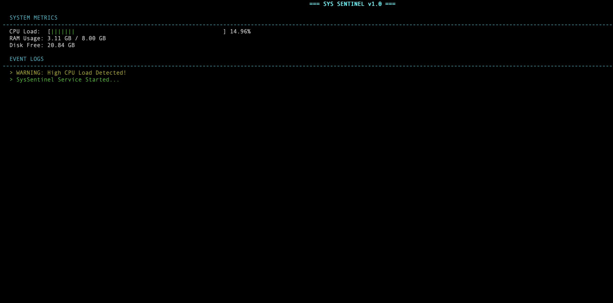

# SysSentinel 🛡️

A high-performance, concurrent system monitoring tool for macOS built with **Modern C++20**.
It visualizes real-time kernel statistics (CPU, RAM, Disk) in a terminal dashboard using a multi-threaded architecture.



## 🚀 Key Features

- **Real-Time Monitoring:** Direct interaction with macOS Kernel API (`mach/mach.h`) and POSIX file systems (`statvfs`)
- **Concurrency:** Producer-Consumer pipeline using `std::jthread`, `std::mutex`, and `std::condition_variable`
- **Visual Dashboard:** Interactive TUI built with `ncurses`
- **Architecture:** Thread-Safe Queue and Observer Pattern for decoupled logging

## 🛠️ Tech Stack & Skills Demonstrated

- **Language:** C++20 (Smart Pointers, Lambdas, `std::jthread`)
- **System API:** Mach Kernel, POSIX, Sysctl
- **Design Patterns:** Observer, Factory, RAII
- **Build System:** CMake
- **Tools:** Clang, LLDB, Git

## 📦 Build Instructions

### Prerequisites

- macOS (Apple Silicon supported)
- CMake & Clang
- Ncurses (`brew install ncurses` usually pre-installed)

### Compile & Run

```bash
mkdir build
cd build
cmake ..
make
./SysSentinel
```

## 🔄 Architecture Overview

The project follows a **Producer-Consumer** pattern with the following components:

1. **Monitor (Producer):** Collects system metrics from Kernel APIs
2. **Dashboard (Consumer):** Renders metrics in an interactive terminal UI
3. **Logger (Observer):** Decoupled logging system for file and console output
4. **Thread-Safe Queue:** Manages communication between components

## 💡 Key Implementation Details

- Uses `std::jthread` for automatic thread management
- Employs `std::condition_variable` for efficient thread synchronization
- Implements RAII principles for resource management
- Direct kernel interaction via `mach` APIs for accurate CPU and memory metrics

## 📄 License

This project is open source. Feel free to use and modify as needed.
